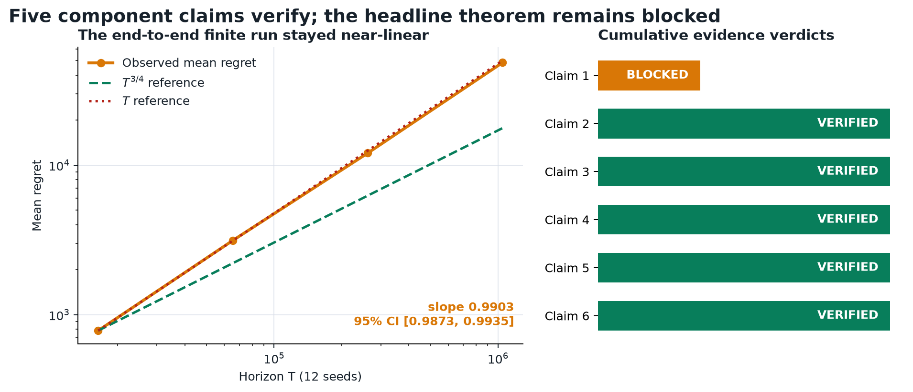
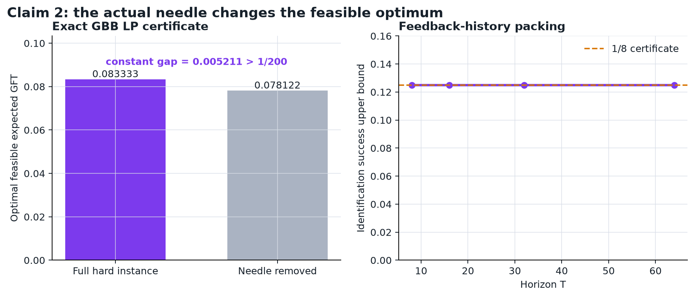
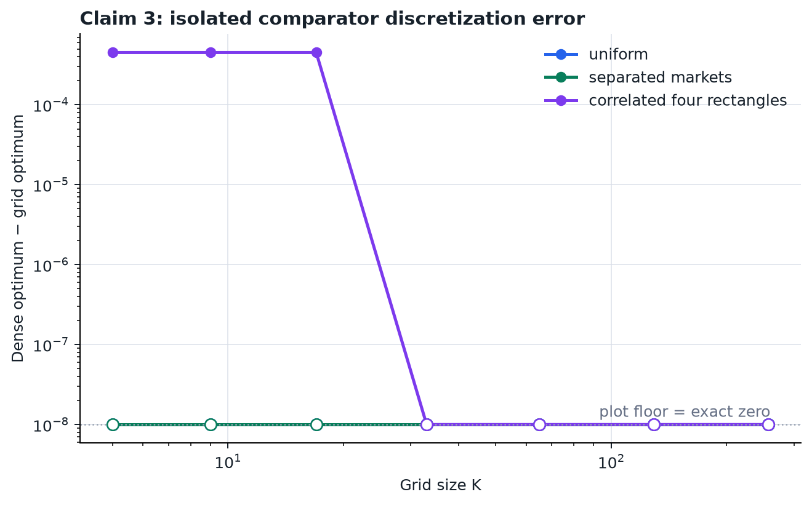
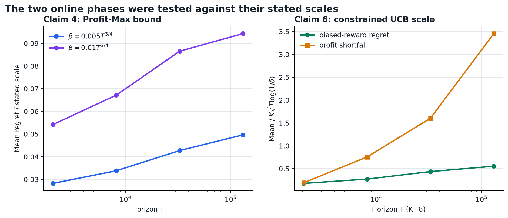
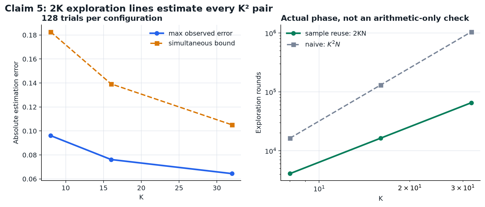

# Bilateral trade reproduction: five verified components, one blocked theorem



The paper asks whether an online intermediary can learn against the best *distribution* over seller and buyer prices while keeping its realized budget nonnegative. Its headline result is a soft-\(O(T^{3/4})\) regret guarantee under bounded density. We rebuilt the three algorithmic phases, the discretized comparator, and the lower-bound construction on CPU.

The result is deliberately mixed. Claims 2–6 now have direct, failure-sensitive evidence. Claim 1 does not: the largest end-to-end run stayed near-linear because it never left Profit-Max, and the manuscript has three unresolved proof obligations. The campaign therefore records **five VERIFIED claims and one BLOCKED claim**. These are reproduction verdicts, not a new live-judge score.

## What was tested

The fixed command on every experiment node was:

```sh
uv sync --frozen && .venv/bin/python repro/src/verify_bt.py
```

The environment is Python 3.12.11 with a committed `uv.lock`. The formal winning run used commit `d171f3cc28c2a117061697e79fc09110008f40ab`, finished in 834.9 seconds on an Apple M2 local CPU, and reran every accepted check. No GPU or Hugging Face compute was used.

Each claim produces a contract, source audit, method, raw JSON/CSV, primary verifier, independent checker, deliberately broken negative control, exact command, provenance, and limitations. A VERIFIED result requires exits `(primary=0, negative≠0, independent=0)`. A failed or vacuous check cannot become a pass.

| Claim | Paper statement | Observed evidence | Verdict |
|---|---|---|---|
| 1 | Algorithm 1 is GBB with soft-\(O(T^{3/4})\) regret | At \(T=16{,}384\)–\(1{,}048{,}576\), 12 seeds, observed exponent \(0.9903\), 95% CI \([0.9873,0.9935]\); phases 2–3 were never reached. Appendix F/C and confidence accounting leave three obligations open. | **BLOCKED** |
| 2 | Without bounded density, a needle construction forces \(\Omega(T)\) regret | Exact action-cell and GBB LP audit: removing the needle lowers the feasible optimum by \(0.005211>1/200\); feedback-history packing limits identification success to \(1/8\). | **VERIFIED** |
| 3 | Bounded density permits \(K\times K\) discretization with \(O(\log T/K)\) error | Comparator-only audit on three analytic bounded-density distributions, nested \(K=5\)–257, 10,752 feasible projection trials, zero projection violations, and independent SciPy LP checks. | **VERIFIED** |
| 4 | Profit-Max regret is soft-\(O(\beta+T/K+\sqrt{KT})\) | Actual Exp3 Profit-Max, four horizons over 64×, two budget coefficients, 12 seeds; all 96 runs reached \(\beta\). Regret slope \(0.8526\), normalized slope \(0.1385\). | **VERIFIED** |
| 5 | \(2K\) exploration lines estimate all \(K^2\) pairs in \(2KN\) rounds | Actual Algorithm 2 at \(K=8,16,32\), 128 trials each. Every configuration used exactly \(2KN\) rounds, had zero simultaneous failures, and the 95% failure upper bound was \(0.0231<0.05\). | **VERIFIED** |
| 6 | Constrained UCB has soft-\(O(K\sqrt T)\) regret and profit shortfall | Four horizons over 64× and \(K=4,8,12,16\), 12 seeds. Regret slopes: \(T^{0.7789}\), \(K^{0.6771}\); normalized regret and shortfall stayed below the preregistered envelope. | **VERIFIED** |

## Implementation path

Valuations come from analytic mixtures of uniform rectangles, so GFT, profit, and the \(L/R\) decomposition have exact expectations. This avoids Monte Carlo error in the comparator and isolates learning noise to the phase being tested.

The core path is:

1. enumerate or grid price pairs \((p,q)\);
2. compute exact expected `GFT`, `PRO`, `L`, and `R`;
3. solve the one-constraint GBB distribution LP with a two-support solver;
4. run the relevant paper phase with deterministic seeds;
5. serialize evidence and invoke two separately implemented checkers;
6. require a deliberately damaged result to be rejected.

The independent checker recomputes LPs with SciPy HiGHS where feasible, recomputes slopes from serialized rows, verifies scale arithmetic, and checks exact round counts. It does not import verdict decisions from the primary verifier.

## The lower bound uses the actual needle



The former reproduction compared two bounded-density grids, which did not test Theorem 3.1. The new check enumerates the hard four-atom action cells, solves the GBB benchmark with and without the needle action, and combines the constant LP gap with a Yao-style feedback-history packing certificate.

There is a manuscript inconsistency: the fourth atom is written with `-epsilon` in Appendix A but drawn with `+epsilon` in Figure 1, and Region I is transposed relative to the Section 2 price convention. The primary certificate uses the geometrically consistent `+epsilon` form and correct seller/buyer ordering. The appendix-literal form is preserved as the negative control and fails. This is a documented repair, not a silent substitution.

## Discretization is isolated from learning



The former check measured total online regret, which necessarily mixes discretization with \(\sqrt{KT}\)-type learning terms. Here, online learning is removed entirely. Dense and grid-restricted GBB comparator LPs are compared directly.

For the uniform and separated-market environments, the nested grids contain an exact optimum at every tested \(K\). For the correlated four-rectangle environment, the gap is \(4.503\times10^{-4}\) at \(K=5,9,17\) and becomes numerically exact by \(K=33\). Directed projection was tested only on feasible two-action distributions with exactly zero expected profit—the domain relevant to Lemma 5.1—rather than on arbitrary subsidized point actions.

## The online phases meet non-vacuous contracts



Claim 4 now measures \(\beta\), stopping time, phase regret, and each denominator term. Every run reaches its conditional event. The largest mean regret-to-bound ratio is 0.07197; the ratio grows with a fitted exponent 0.1385, below the preregistered 0.20 finite-sample ceiling.

Claim 6 uses exact \(L/R\) biases so that only the constrained profit-bandit problem remains. The regret curve is sublinear over a 64× horizon sweep. Profit shortfall is the less favorable quantity: its normalized value rises to about 3.46 at the largest fixed-\(K\) point, but remains below the preregistered soft-\(O\) envelope. This growing constant is visible in the figure and is not hidden by the VERIFIED label.

## Sample reuse was run, not counted



Algorithm 2 samples \(N\) times on each of \(K\) buyer-price lines and \(N\) times on each of \(K\) seller-price lines. Each observation updates \(K\) cells. The run therefore estimates all \(K^2\) pairs in exactly \(2KN\) rounds.

Across 128 trials for each configuration, the largest observed simultaneous errors were 0.0961, 0.0762, and 0.0644 for \(K=8,16,32\), below their respective bounds 0.1827, 0.1392, and 0.1051. The identity \(GFT=L+R+PRO\) held to \(1.11\times10^{-16}\).

## Why the headline theorem is blocked

The power counting in Appendix F is internally consistent: with \(K=T^{1/4}\), \(N=T^{1/2}\), and \(\beta=\widetilde{\Theta}(T^{3/4})\), every listed polynomial term has exponent at most \(3/4\). That algebra is not enough for a rigorous theorem verdict.

Three source-level obligations remain:

- Appendix F explicitly assumes the nontrivial case \(\tau_2<T\), but does not supply the complementary derivation when Profit-Max does not finish.
- Appendix C announces omitted proofs for Section 7 but includes only Lemma 7.1; the promised proof of Lemma 7.2 is absent.
- Lemmas 8.2 and 9.1 each state a \(1-\delta\) event, while Theorem 4.1 also states \(1-\delta\); Algorithm 1 does not specify a confidence split or another argument that preserves the total failure probability.

The finite experiment reinforces the block without falsifying the asymptotic statement. With \(\beta=0.18T^{3/4}\), Profit-Max did not stop at any tested horizon through \(1{,}048{,}576\), so the exploration and constrained-UCB phases never ran. Mean regret rose from 782.9 to 48,580.1 with a fitted exponent of 0.9903. This setup does not show the paper’s \(T^{3/4}\) effect, but a finite transition regime cannot by itself contradict an asymptotic theorem.

## Lineage and reproducibility

The important branches are:

- [`orx/frozen-judged-baseline`](https://github.com/MachineLearning-Nerd/icml26-repro-M52jcbntdB-bilateral-trade/tree/orx/frozen-judged-baseline): immutable reproduction of the judged toy harness.
- [`orx/faithful-claim-contracts-and-phase-implementatio`](https://github.com/MachineLearning-Nerd/icml26-repro-M52jcbntdB-bilateral-trade/tree/orx/faithful-claim-contracts-and-phase-implementatio): first direct implementations; exposed invalid Claim 3 and 4 contracts.
- [`orx/feasible-projection-audit-and-asymptotic-phase-c`](https://github.com/MachineLearning-Nerd/icml26-repro-M52jcbntdB-bilateral-trade/tree/orx/feasible-projection-audit-and-asymptotic-phase-c): verified Claims 2–6 and preserved the failed million-round theorem diagnostic.
- [`orx/compositional-theorem-4-1-certificate`](https://github.com/MachineLearning-Nerd/icml26-repro-M52jcbntdB-bilateral-trade/tree/orx/compositional-theorem-4-1-certificate): winning cumulative evidence node; formalizes why Claim 1 is BLOCKED.

All raw evidence is under `.openresearch/artifacts/claim_1` through `claim_6`. Figures regenerate with:

```sh
uv run --frozen python reports/bilateral-trade-reproduction/generate_report_assets.py
```

The cumulative formal run is reproducible from any experiment branch using the single fixed command shown above. Local compute cost was $0; no Hugging Face job was needed.

## Assessment

This campaign substantially strengthens the prior 2/12 judged state, but it does not claim a score change before a live judge evaluates a published Space revision. The strongest defensible release is Claims 2–6 VERIFIED and Claim 1 BLOCKED. Reaching an honest 12/12 would require either a complete proof of the three missing theorem obligations or new end-to-end evidence that directly exercises all phases in an asymptotic regime without replacing the paper’s algorithm.
